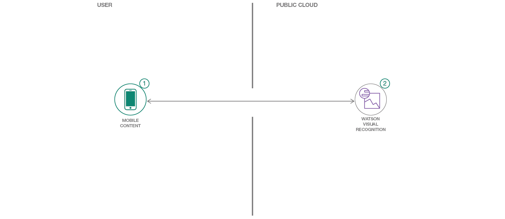
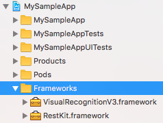
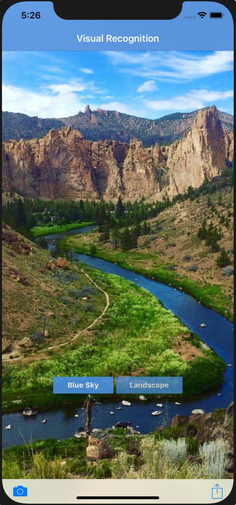
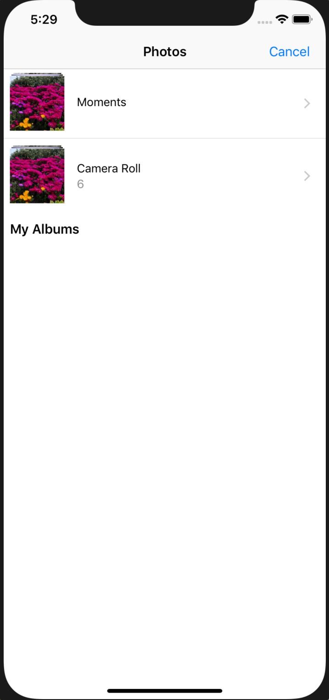
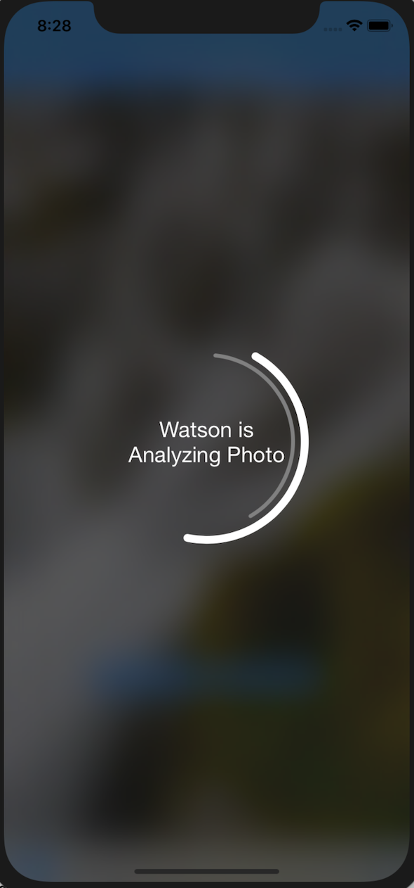
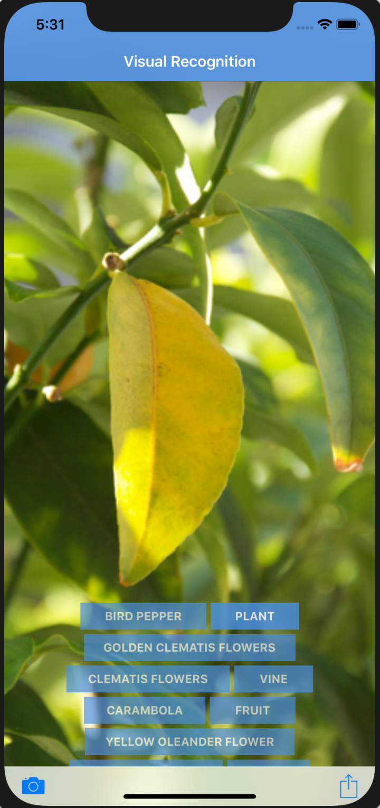
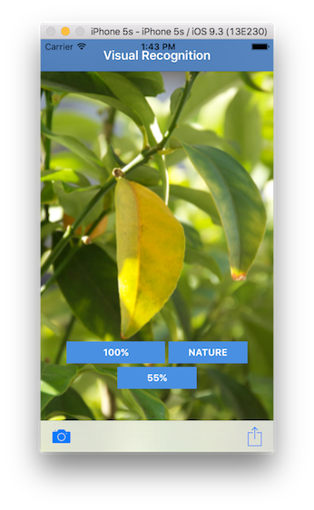

[](https://bluemix.net)
[](https://developer.apple.com/swift/)

# Create an iOS application in Swift which uses image recognition

In this code pattern, you will create an iOS app that showcases computer vision by labeling what the device's camera sees. You will provision a Visual Recognition service where you can either leverage a demo model or train your own custom model.

When you have completed this code pattern, you will understand how to:

* Customize Watson Visual Recognition for your unique use case
* View the labels related to a picture and the estimated accuracy of that label



## Steps

> As an alternative to steps 1 & 2 below, you can [create this project as a starter kit](https://cloud.ibm.com/developer/mobile/create-app?defaultDeploymentToolchain=&defaultLanguage=IOS_SWIFT&env_id=ibm%3Ayp%3Aus-south&starterKit=22179578-addd-392f-bbf8-b1b128dd9cb8&tenantNavMode=true) on IBM Cloud, which automatically provisions required services, and injects service credentials into a custom fork of this pattern. Then, you can skip directly to step 3 below.

1. [Install development dependencies](#1-install-development-dependencies)
1. [Configure service credentials](#2-configure-service-credentials)
1. [Run](#3-run)

### 1. Install development dependencies

Ensure you have the correct [development tools](https://developer.apple.com/) installed to work with:

* iOS 8.0+
* Xcode 10
* Swift 3.0+

Next, the IBM Cloud Mobile services SDK uses [CocoaPods](https://cocoapods.org/) to manage and configure dependencies. To use our latest SDKs you need version _1.1.0.rc.2_.

You can install CocoaPods using the following command:

```bash
$ sudo gem install cocoapods --pre
```

If the CocoaPods repository is not already configured, run the following command:

```bash
$ pod setup
```

A `Podfile` is included in the root of this repository. To download and install the required dependencies, run the following command from the root of the repository:

```bash
$ pod install
```

Now open the Xcode workspace, `{APP_Name}.xcworkspace`. From now on, open the `.xcworkspace` file because it contains all the dependencies and configurations.

If you run into any issues during the pod install, it is recommended to run a pod update by using the following commands:

```bash
$ pod update
$ pod install
```

Next, this pattern uses the Watson Developer Cloud iOS SDK in order to use the Watson Visual Recognition service.

The Watson Developer Cloud iOS SDK uses [Carthage](https://github.com/Carthage/Carthage) to manage dependencies and build binary frameworks.

You can install Carthage with [Homebrew](https://brew.sh/):

```bash
$ brew update
$ brew install carthage
```

A pre-configured `Cartfile` is included in the root of this repository. Run the
following command to build the dependencies and frameworks:

```bash
$ carthage update --platform iOS
```

> **Note**: You may have to run `carthage update --platform iOS --no-use-binaries`, if the binary is a lower version than your current version of Swift.

Once the build has completed, the frameworks can be found in the `(projectrootdirectory)/Carthage/Build/iOS/` folder. The Xcode project in this pattern already includes framework links to the following frameworks in this directory:

* `VisualRecognitionV3.framework`
* `RestKit.framework`



If you build your Carthage frameworks in a separate folder, you will have to drag-and-drop the above frameworks into your project and link them in order to run this pattern successfully.

### 2. Configure service credentials

Use the [IBM Cloud Catalog](https://cloud.ibm.com/catalog/) to [create a Visual Recognition service instance](https://cloud.ibm.com/catalog/services/visual-recognition) on the Lite plan.

When the service has been created, navigate to the **Service credentials** tab, and create a **New credential ⊕** with the default options. Click **View credentials**. Edit `visualrecognitionios/BMSCredentials.plist` in your Xcode project to configure your application with your own service credentials.

### 3. Run

You can now run the application on a simulator or physical device:

|   |   |   |
| - | - | - |
|  |  |  |
|  |  |  |

The application allows you to do Visual Recognition for images from your Photo Library or from an image you take using a physical device's camera. Take a photo using your device's camera or choose a photo from your library using the toolbar buttons on the bottom of the application. Once an image is chosen, the Watson Visual Recognition service will analyze the photo and create tags for the photo. You can click the tags to see a percentage value which shows how confident Watson is.

## License

This code pattern is licensed under the Apache License, Version 2. Separate third-party code objects invoked within this code pattern are licensed by their respective providers pursuant to their own separate licenses. Contributions are subject to the [Developer Certificate of Origin, Version 1.1](https://developercertificate.org/) and the [Apache License, Version 2](https://www.apache.org/licenses/LICENSE-2.0.txt).

[Apache License FAQ](https://www.apache.org/foundation/license-faq.html#WhatDoesItMEAN)
