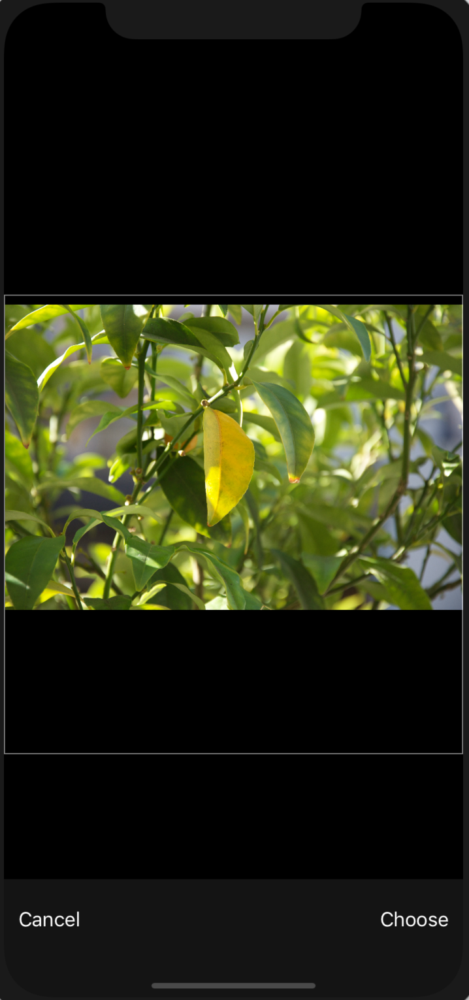
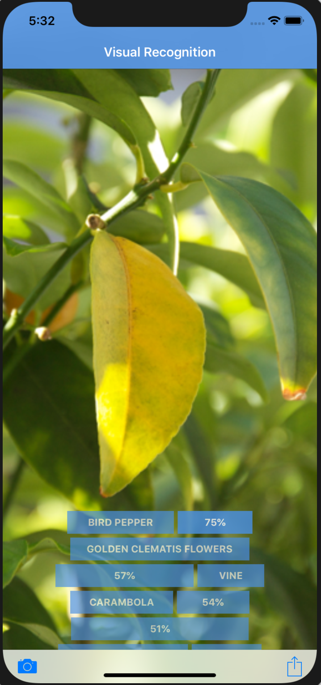

[](https://bluemix.net)
[](https://developer.apple.com/swift/)

# Create an iOS application in Swift which uses image recognition

> We have a similar pattern available for [Android](https://github.com/IBM/visual-recognition-android), as well!

In this code pattern, you will create an iOS app that showcases computer vision by labeling what the device's camera sees. You will provision a Visual Recognition service where you can either leverage a demo model or train your own custom model.

When you have completed this code pattern, you will understand how to:

* Customize Watson Visual Recognition for your unique use case
* View the labels related to a picture and the estimated accuracy of that label


## Steps

1. [Install development dependencies](#1-install-development-dependencies)
1. [Watson Credential Management](2-watson-credential-management)
1. [Run](#3-run)

### 1. Install development dependencies

Ensure you have the correct [development tools](https://developer.apple.com/) installed to work with:

* iOS 8.0+
* Xcode 8
* Swift 3.0

Next, the IBM Cloud Mobile services SDK uses [CocoaPods](https://cocoapods.org/) to manage and configure dependencies. To use our latest SDKs you need version _1.1.0.rc.2_.

You can install CocoaPods using the following command:

```bash
$ sudo gem install cocoapods --pre
```

If the CocoaPods repository is not already configured, run the following command:

```bash
$ pod setup
```

A `Podfile` is included in the root of this repository. To download and install the required dependencies, run the following command from the root of the repository:

```bash
$ pod install
```

Now open the Xcode workspace, `{APP_Name}.xcworkspace`. From now on, open the `.xcworkspace` file becuase it contains all the dependencies and configurations.

If you run into any issues during the pod install, it is recommended to run a pod update by using the following commands:

```bash
$ pod update
$ pod install
```

Next, this pattern uses the Watson Developer Cloud iOS SDK in order to use the Watson Visual Recognition service.

The Watson Developer Cloud iOS SDK uses [Carthage](https://github.com/Carthage/Carthage) to manage dependencies and build binary frameworks.

You can install Carthage with [Homebrew](http://brew.sh/):

```bash
$ brew update
$ brew install carthage
```

To use the Watson Developer Cloud iOS SDK in any of your applications, specify it in your `Cartfile`:

```
github "watson-developer-cloud/ios-sdk"
```

A pre-configured `Cartfile` has been included in the root of the repository. Run the following command to build the dependencies and frameworks:

```bash
$ carthage update --platform iOS
```

> **Note**: You may have to run `carthage update --platform iOS --no-use-binaries`, if the binary is a lower version than your current version of Swift.

Once the build has completed, the frameworks can be found in the `(projectrootdirectory)/Carthage/Build/iOS/` folder. The Xcode project in this pattern already includes framework links to the following frameworks in this directory:

* `VisualRecognitionV3.framework`
* `RestKit.framework`


If you build your Carthage frameworks in a separate folder, you will have to drag-and-drop the above frameworks into your project and link them in order to run this pattern successfully.

## 2. Watson Credential Management

Once the dependencies have been built and configured for the IBM Cloud Mobile service SDKs as well as the Watson Developer Cloud SDK, no more actions are needed! The unique credentials to your IBM Cloud Visual Recognition service have been injected into the application during generation.

## 3. Run

You can now run the application on a simulator or physical device:







The application allows you to do Visual Recognition for images from your Photo Library or from an image you take using your device's camera (physical device only). Take a photo using your device's camera or choose a photo from your library using the toolbar buttons on the bottom of the application. Once an image is chosen, the Watson Visual Recognition service will analyze the photo and create tags for the photo. You can click the tags to see a percentage value which shows how confident Watson is. For an image with a face present, Watson will attempt to show a gender and age value as well as a celebrity match if one is provided.

## License

[Apache 2.0](LICENSE)
